# Jarkom-Modul-3-D26-2023

Laporan Resmi Praktikum Jaringan Komputer Modul 3

* Fathan Abi Karami (5025211156)
* Alya Putri Salma (5025211174)

# Soal 0
Perjalanan selanjutnya akan menggunakan peta berikut:

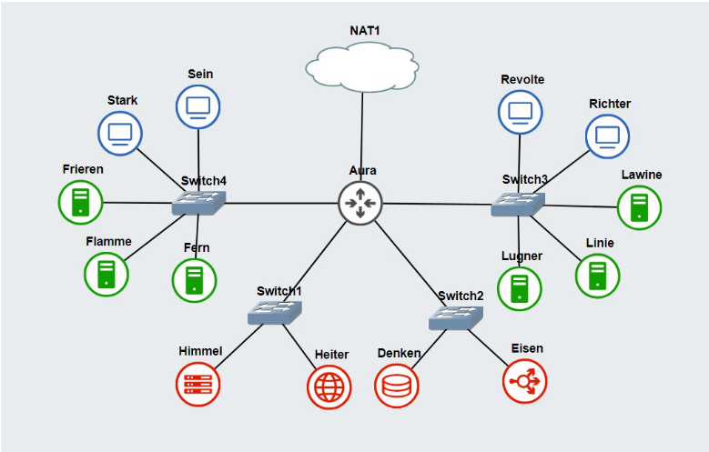

dengan ketentuan sebagai berikut:

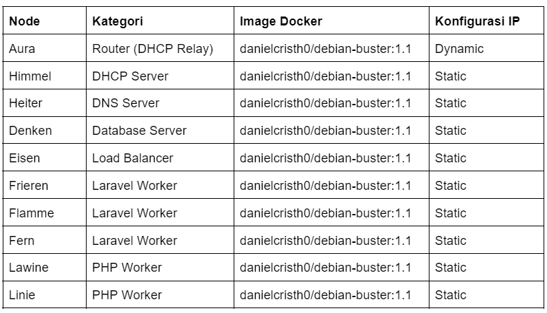
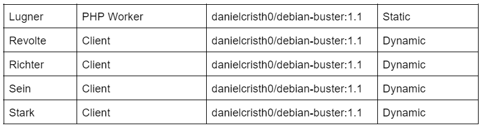

Setelah mengalahkan Demon King, perjalanan berlanjut. Kali ini, kalian diminta untuk melakukan register domain berupa riegel.canyon.yyy.com untuk worker Laravel dan granz.channel.yyy.com untuk worker PHP (0) mengarah pada worker yang memiliki IP [prefix IP].x.1.

## Pengerjaan

### Configure Network Adapter

Buat topologi seperti pada gambar. lalu configure network tiap node

Aura:
```txt
auto eth0
iface eth0 inet dhcp

auto eth1
iface eth1 inet static
	address 192.204.1.1
	netmask 255.255.255.0

auto eth2
iface eth2 inet static
	address 192.204.2.1
	netmask 255.255.255.0

auto eth3
iface eth3 inet static
	address 192.204.3.250
	netmask 255.255.255.0

auto eth4
iface eth4 inet static
	address 192.204.4.250
	netmask 255.255.255.0
```

Himmel:
```txt
auto eth0
iface eth0 inet static
	address 192.204.1.2
	netmask 255.255.255.0
	gateway 192.204.1.1
```

Heither:
```txt
auto eth0
iface eth0 inet static
	address 192.204.1.3
	netmask 255.255.255.0
	gateway 192.204.1.1
```

Denken:
```txt
auto eth0
iface eth0 inet static
	address 192.204.2.2
	netmask 255.255.255.0
	gateway 192.204.2.1
```

Eisen:
```txt
auto eth0
iface eth0 inet static
	address 192.204.2.3
	netmask 255.255.255.0
	gateway 192.204.2.1
```

Frieren:
```txt
auto eth0
iface eth0 inet static
	address 192.204.4.1
	netmask 255.255.255.0
	gateway 192.204.4.250
```

Flamme:
```txt
auto eth0
iface eth0 inet static
	address 192.204.4.2
	netmask 255.255.255.0
	gateway 192.204.4.250
```

Fern:
```txt
auto eth0
iface eth0 inet static
	address 192.204.4.3
	netmask 255.255.255.0
	gateway 192.204.4.250
```

Lawine:
```txt
auto eth0
iface eth0 inet static
	address 192.204.3.1
	netmask 255.255.255.0
	gateway 192.204.3.250
```

Linie:
```txt
auto eth0
iface eth0 inet static
	address 192.204.3.2
	netmask 255.255.255.0
	gateway 192.204.3.250
```

Lugner:
```txt
auto eth0
iface eth0 inet static
	address 192.204.3.3
	netmask 255.255.255.0
	gateway 192.204.3.250
```

### Configure Aura
pada router buat script start.sh di root untuk membuat iptables dan update

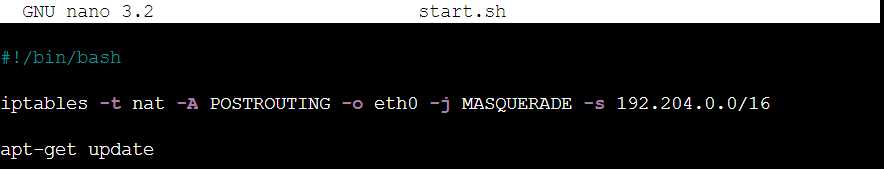

cari IP DNS menngunakan
```bash
cat /etc/resolv.conf
```

didapat

```txt
nameserver 192.168.122.1
```

### configure DNS pada Heither

buat script start.sh di root untuk configure DNS pada heither dan jalankan apt-get update

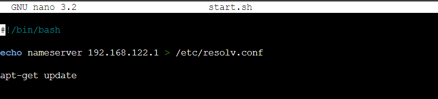

kemudian buat script configBind.sh untuk config DNS untuk granz.channel.d26.com dan riegel.canyon.d26.com. 

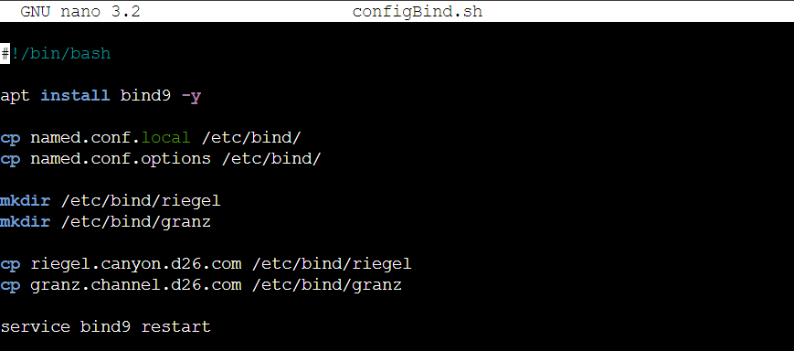

pertama script akan menginstall package bind9. kemudian akan men-copy named.conf.local ke /etc/bind/ , yang berisikan:

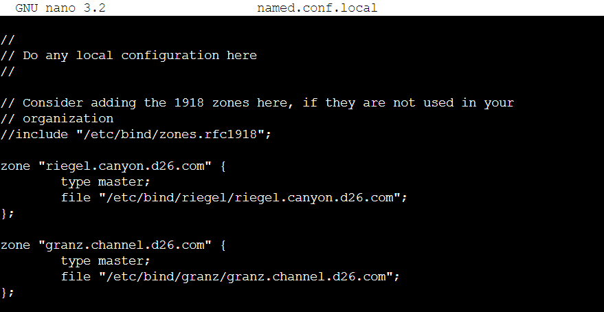

kemudian copy named.conf.options ke /etc/bind/ , yang berisikan:

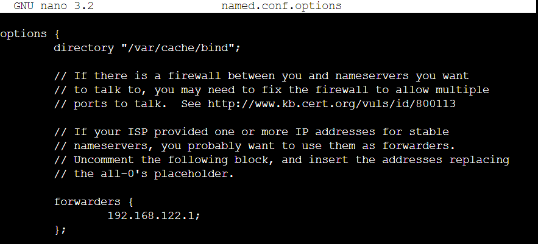
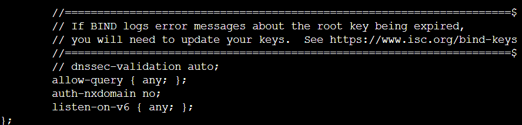

kemudian buat directory granz dan riegel di /etc/bind/

kemudian copy riegel.canyon.d26.com ke /etc/bind/riegel , yang berisikan konfigurasi dns riegel.canyon.d26.com:

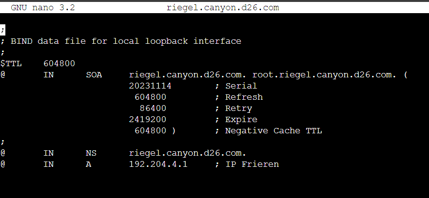

kemudian copy granz.channel.d26.com ke /etc/bind/granz , yang berisikan konfigurasi dns granz.channel.d26.com:

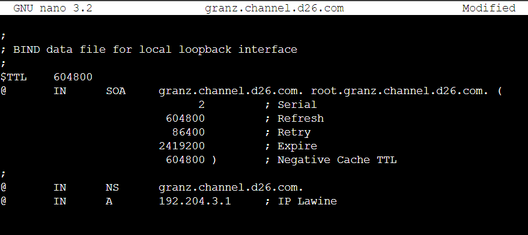

kemudian restart service bind9

# Soal 1
Lakukan konfigurasi sesuai dengan peta yang sudah diberikan.

Kemudian, karena masih banyak spell yang harus dikumpulkan, bantulah para petualang untuk memenuhi kriteria berikut:
Semua CLIENT harus menggunakan konfigurasi dari DHCP Server.

## Pengerjaan
pada tiap node client, configure network menjadi:

Revolte:
```txt
auto eth0
iface eth0 inet dhcp
```

Richter:
```txt
auto eth0
iface eth0 inet dhcp
```

Sein:
```txt
auto eth0
iface eth0 inet dhcp
```

Stark:
```txt
auto eth0
iface eth0 inet dhcp
```

# Soal 2, 3, 4, 5
* Client yang melalui Switch3 mendapatkan range IP dari [prefix IP].3.16 - [prefix IP].3.32 dan [prefix IP].3.64 - [prefix IP].3.80. 
* Client yang melalui Switch4 mendapatkan range IP dari [prefix IP].4.12 - [prefix IP].4.20 dan [prefix IP].4.160 - [prefix IP].4.168. 
* Client mendapatkan DNS dari Heiter dan dapat terhubung dengan internet melalui DNS tersebut 
* Lama waktu DHCP server meminjamkan alamat IP kepada Client yang melalui Switch3 selama 3 menit sedangkan pada client yang melalui Switch4 selama 12 menit. Dengan waktu maksimal dialokasikan untuk peminjaman alamat IP selama 96 menit

## Pengerjaan
### Config DHCP Server (Himmel)
buat script configDhcp.sh untuk mengkonfigurasi DHCP Server di Himmel. Script berisikan:

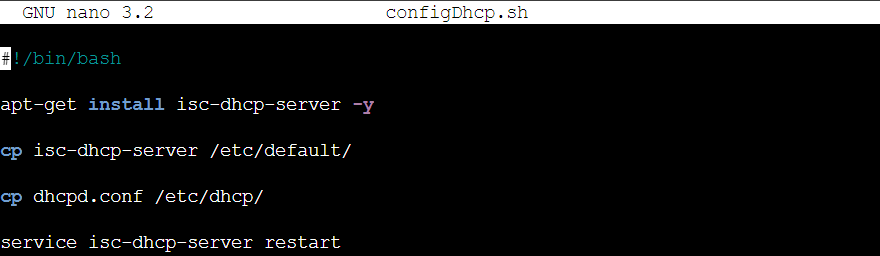

pertama script akan menginstall package isc-dhcp-server. kemudian akan men-copy isc-dhcp-server yang berisikan config interface dhcp server ke /etc/default/ , yang berisikan:

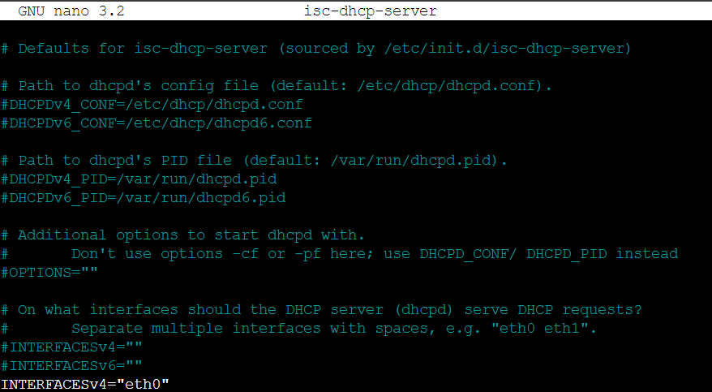

isc-dhcp-server meng-config INTERFACESv4 = eht0. kemudian akan men-copy dhcpd.conf yang berisikan config dhcp , ke /etc/dhcp/. 

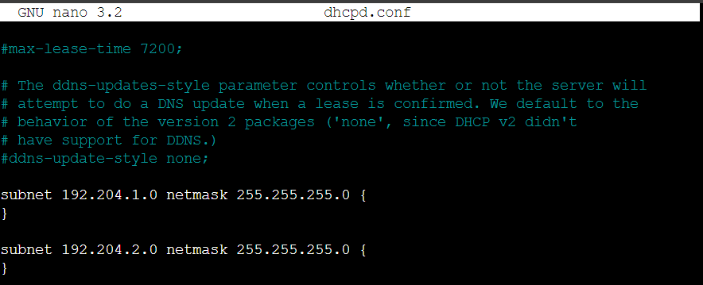
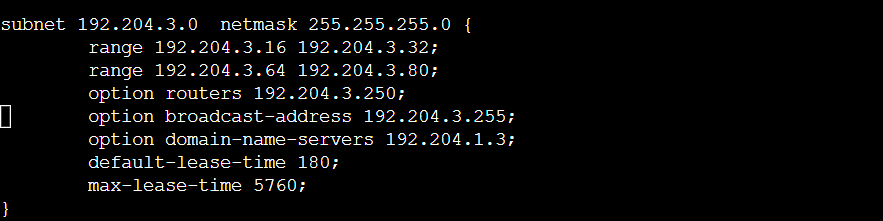
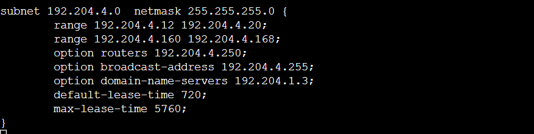

pada dhcp.conf terdapat config untuk subnet 192.204.3.0 yang mengatur client yang melalui switch3 dan subnet 192.204.4.0 yang mengatur client yang melalui switch4. range ip diatur pada range. DNS diatur pada option domain-name-servers. Lama waktu DHCP server meminjamkan alamat IP kepada Client diatur pada default-lease-time (dalam satuan second). waktu maksimal dialokasikan untuk peminjaman alamat IP diatur pada max-lease-time (dalam satuan second). sesuaikan default-lease-time tiap subnet dengan ketentuan di soal. kemudian restart service isc-dhcp-server.

### Configure DHCP-Relay (Aura)
Atur node Aura sebagai DHCP Relay. pada node Aura buat script configDhcpRelay.sh yang berisikan:

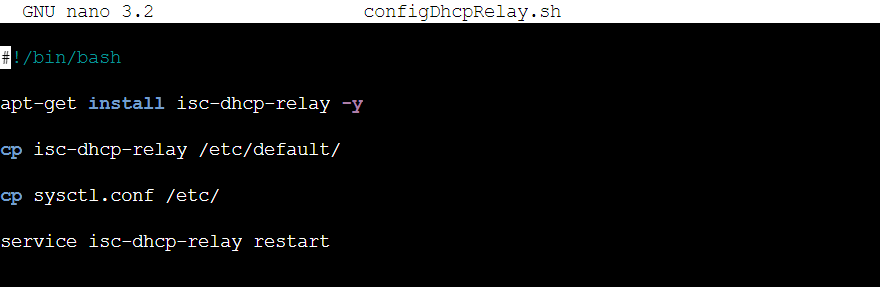

pertama install package isc-dhcp-relay. kemudain copy isc-dhcp-relay yang berisikan konfigurasi dhcp relay ke /etc/default/ :

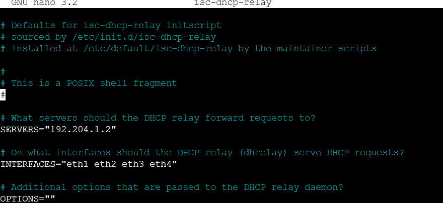

SERVERS di set ke IP DHCP Server (Himmel). INTERFACES di set ke eth1 eth2 eth3 eth4. kemudian copy sysctl.conf ke /etc/.

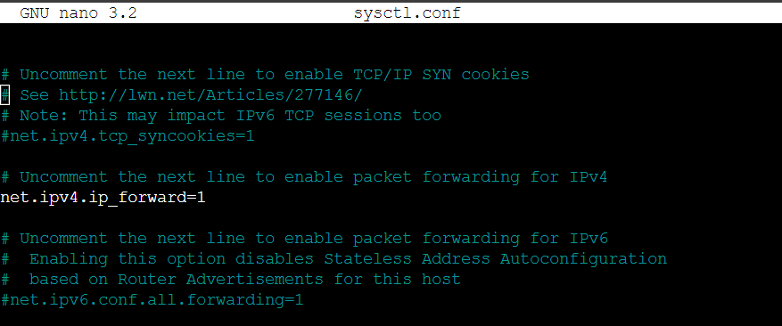

kemudian restart service isc-dhcp-relay.

saat dijalankankan: 

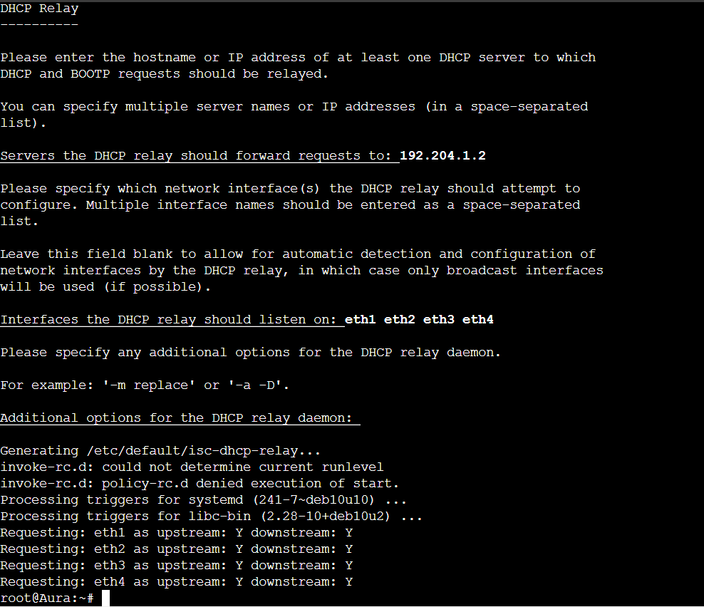

set forward ke 192.204.1.2 (IP DHCP Server himmel)

set Listen DHCP Relay ke eth1 eth2 eth3 eht4

skip option dhcp relay daemon

## Testing
### DHCP 
Revolte:

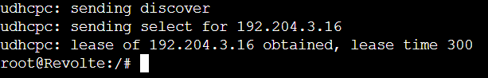

Richter:

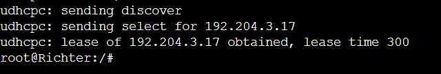

Sein:

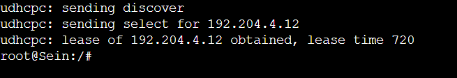

Stark:

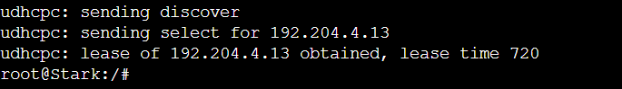


### DNS
ping google.com, granz.channel.d26.com, riegel.canyon.d26.com:

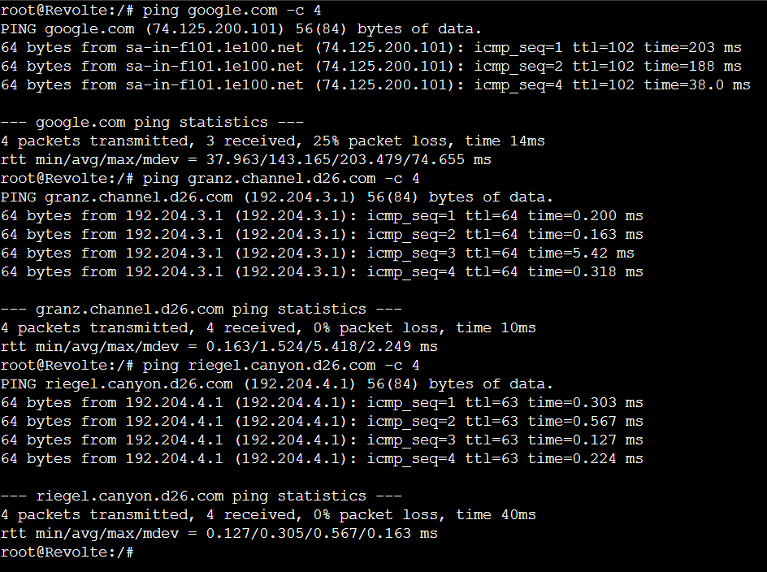

# Soal 6
Pada masing-masing worker PHP, lakukan konfigurasi virtual host untuk website berikut dengan menggunakan php 7.3

## Pengerjaan
### Deploy Web Server Pada Tiap Worker
Pertama buat script start.sh pada tiap worker untuk config DNS dan update apt.

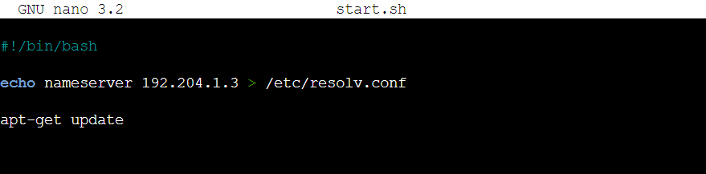

download source code dari link gdrive menggunakan wget dan unzip menggunakan unzip

kemudian buat script configWebServer.sh untuk mengkonfig webServer menggunakan nginx.

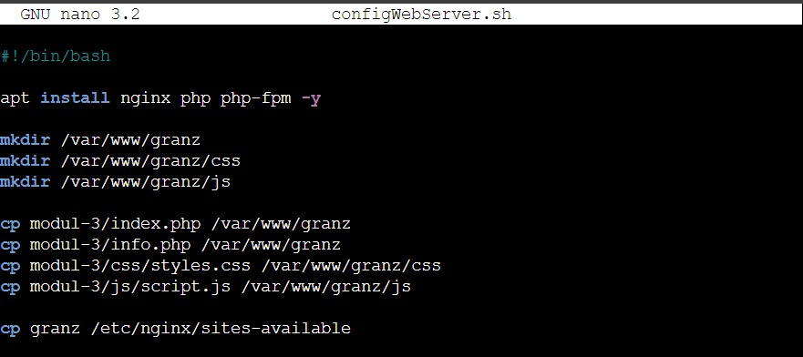
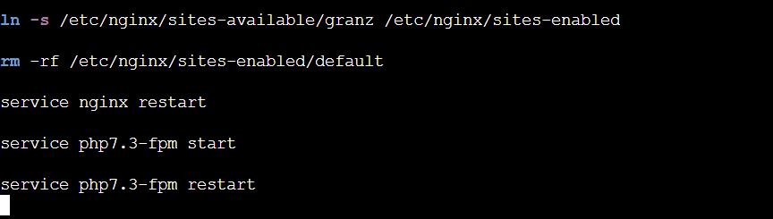

pertama install package nginx, php, dan php-fpm. kemudian buat direktori granz, granz/css, dan granz/js di /var/www/ untuk menyimpan source code web. 

kemudian copy source code yang sudah di download ke direktori yang baru dibuat.

kemudian copy granz yang berisikan konfigurasi web server ke /etc/nginx/sites-available 

worker lawine:

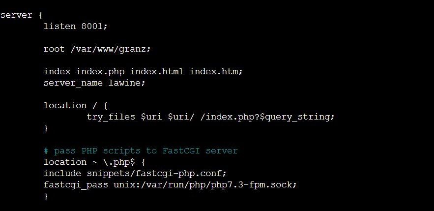
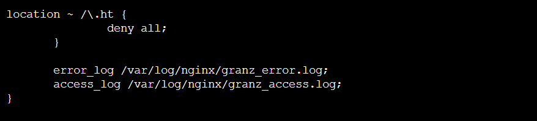

worker linie:

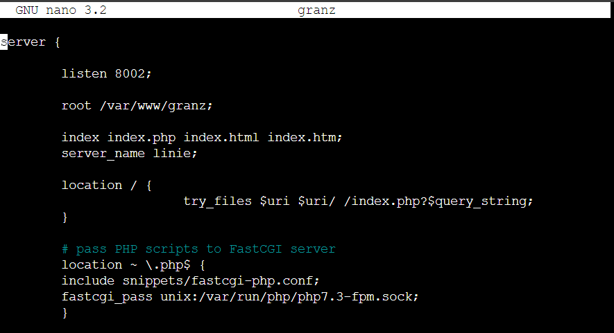
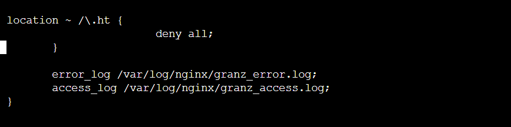

worker lugner:

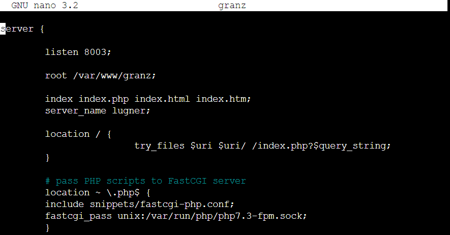
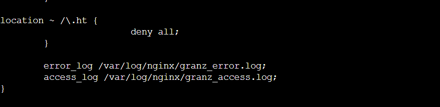

kemudian buat symbolic link antara /etc/nginx/sites-available/granz dengan /etc/nginx/sites-enabled. kemudian remove default pada /etc/nginx/sites-enabled. kemudian restart nginx dan php-fpm

### Setup Proxy (Lawine)
karena granz.channel.d26.com mengarah ke worker (lawine) sedangkan load balancer berada pada node eisen, maka perlu dilakukan set up proxy di lawine untuk proxy pass dari lawine ke eisen. 

buat script configProxy.sh

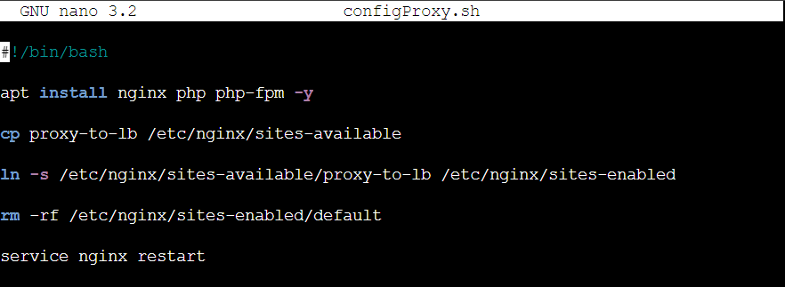

pertama install package nginx, php, dan php-fpm. kemudian copy proxy-to-lb yang berisikan konfigurasi proxy ke /etc/nginx/sites-available

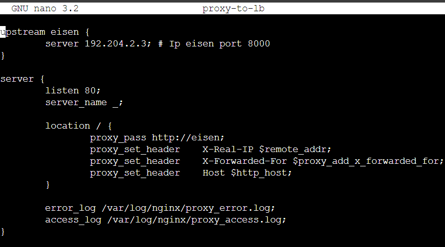

kemudian buat symbolic link antara /etc/nginx/sites-available/granz dengan /etc/nginx/sites-enabled. kemudian remove default pada /etc/nginx/sites-enabled. kemudian restart nginx

### Setup LB (Eisen)
kemudian configure load balancer di eisen untuk membagi work ke worker php.

buat script confLB.sh yang berisikan konfigurasi lb:

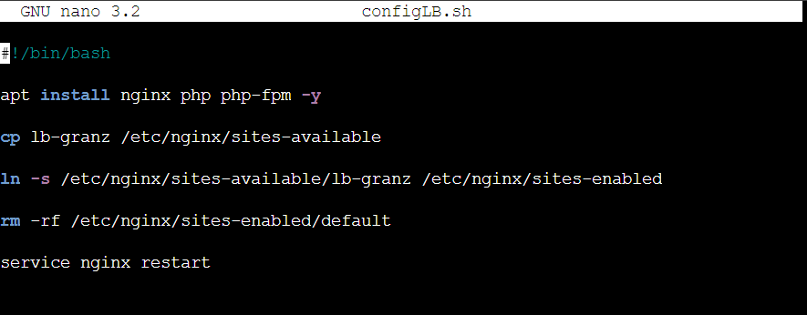

pertama install package nginx, php, dan php-fpm. kemudian copy lb-granz yang berisikan konfigurasi load balancer ke /etc/nginx/sites-available.

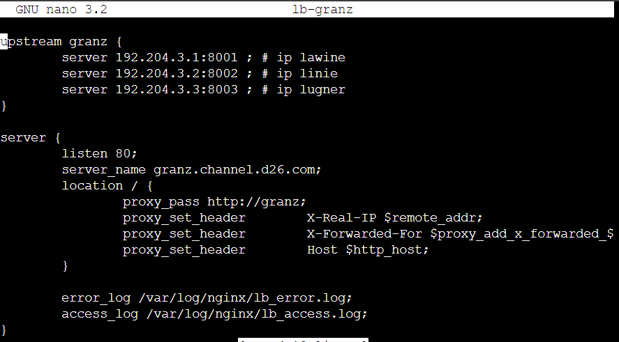
kemudian buat symbolic link antara /etc/nginx/sites-available/granz dengan /etc/nginx/sites-enabled. kemudian remove default pada /etc/nginx/sites-enabled. kemudian restart service nginx

## Testing
testing granz.channel.d26.com menggunakan lynx

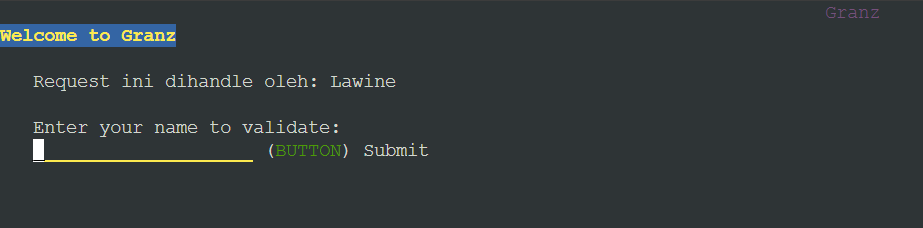
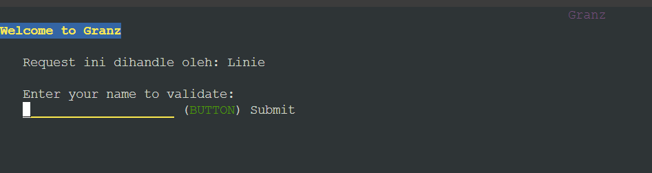
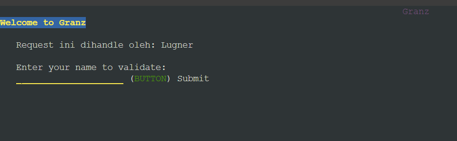

# Soal 7
Kepala suku dari Bredt Region memberikan resource server sebagai berikut:
* Lawine, 4GB, 2vCPU, dan 80 GB SSD.
* Linie, 2GB, 2vCPU, dan 50 GB SSD.
* Lugner 1GB, 1vCPU, dan 25 GB SSD.
aturlah agar Eisen dapat bekerja dengan maksimal, lalu lakukan testing dengan 1000 request dan 100 request/second.

## Pengerjaan
dilihat dari spesifikasi yang diberikan didapat urutan server dari yang paling powerful adalah lawine - linie - lugner. modifikasi lb-granz di eisen dengan menambahkan weight sesuai dengan urutan.

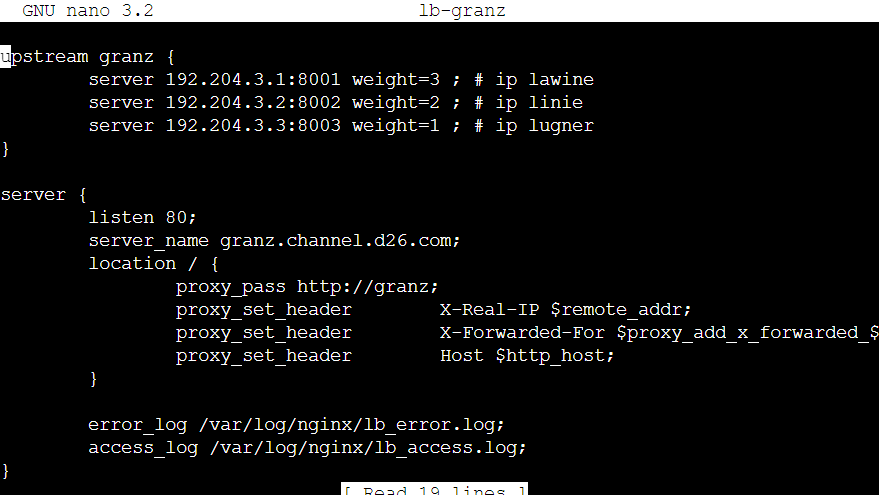

## Testing
lakukan testing menggunakan apache benchmark dari package apache2-utils. gunakkan command:
```bash
ab -n 1000 -c 100 granz.channel.d26.com/
```
Hasil:

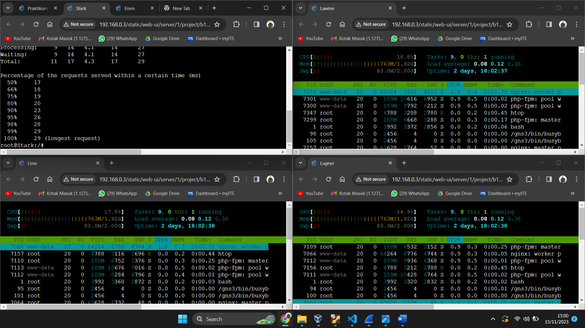


# Soal 8
Karena diminta untuk menuliskan grimoire, buatlah analisis hasil testing dengan 200 request dan 10 request/second masing-masing algoritma Load Balancer dengan ketentuan sebagai berikut:
* Nama Algoritma Load Balancer
* Report hasil testing pada Apache Benchmark
* Grafik request per second untuk masing masing algoritma. 
* Analisis (8)

## Round Robin
Modifikasi lb-granz menjadi:

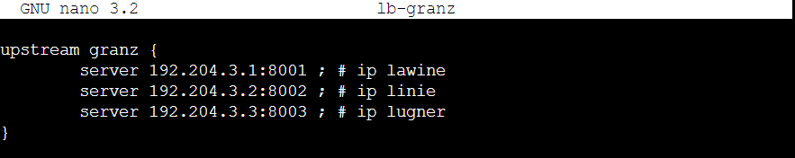

hasil testing:

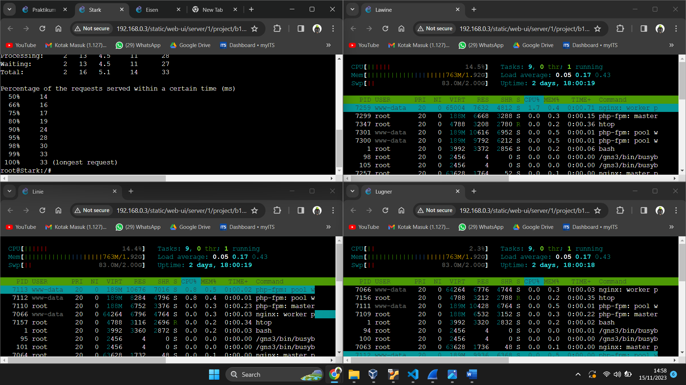


## Weighted Round Robin
modifikasi lb-granz menjadi:
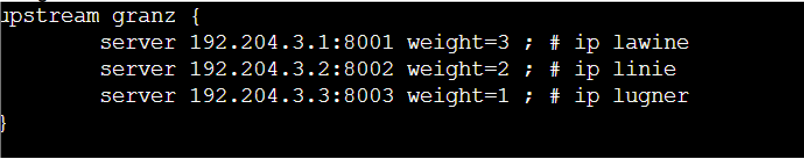

hasil testing:


## Least Connection
modifikasi lb-granz menjadi:
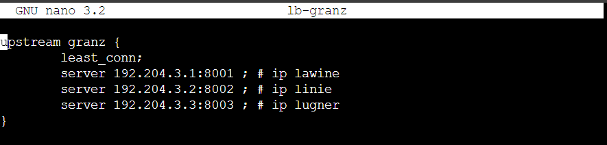


hasil testing:


## IP Hash
modifikasi lb-granz menjadi:
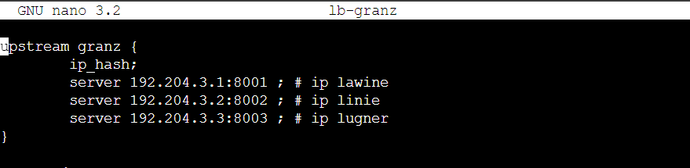


hasil testing:
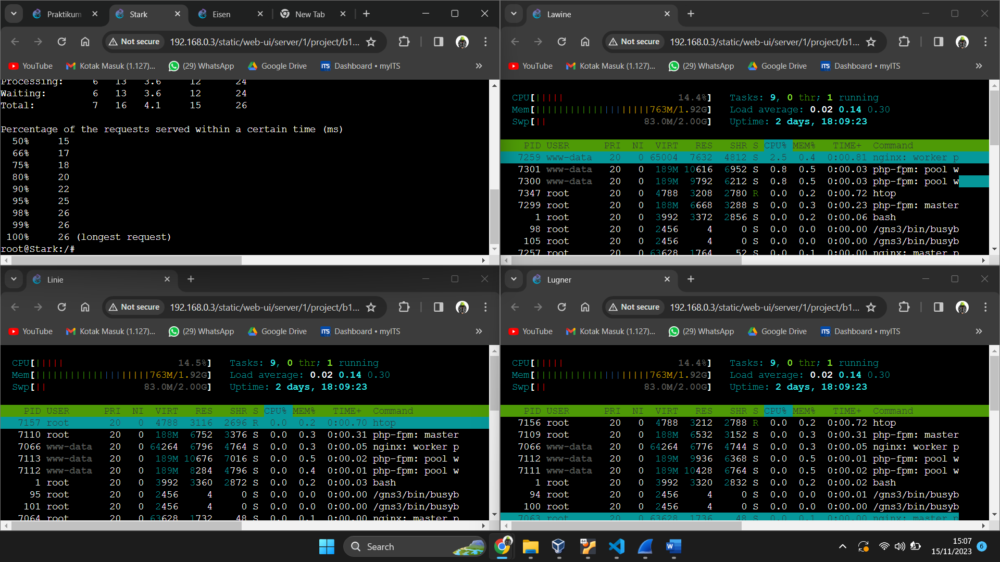


## generic Hash
modifikasi lb-granz menjadi:
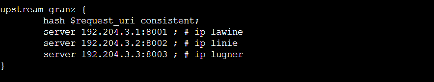


hasil testing:
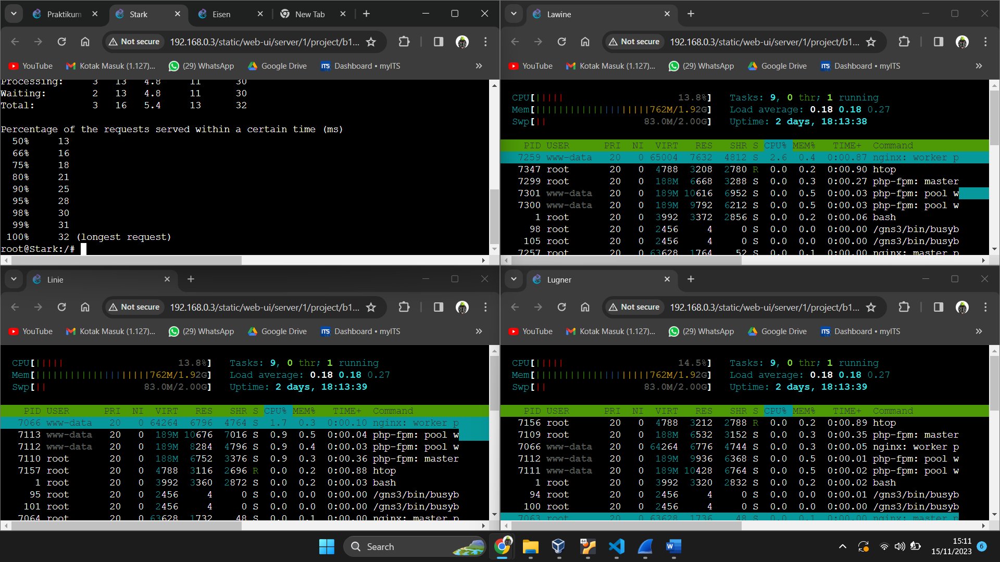


# Soal 9
Dengan menggunakan algoritma Round Robin, lakukan testing dengan menggunakan 3 worker, 2 worker, dan 1 worker sebanyak 100 request dengan 10 request/second, kemudian tambahkan grafiknya pada grimoire.

## 3 Worker
Hasil Testing:


## 2 Worker
Stop nginx di lugner

Hasil Testing:
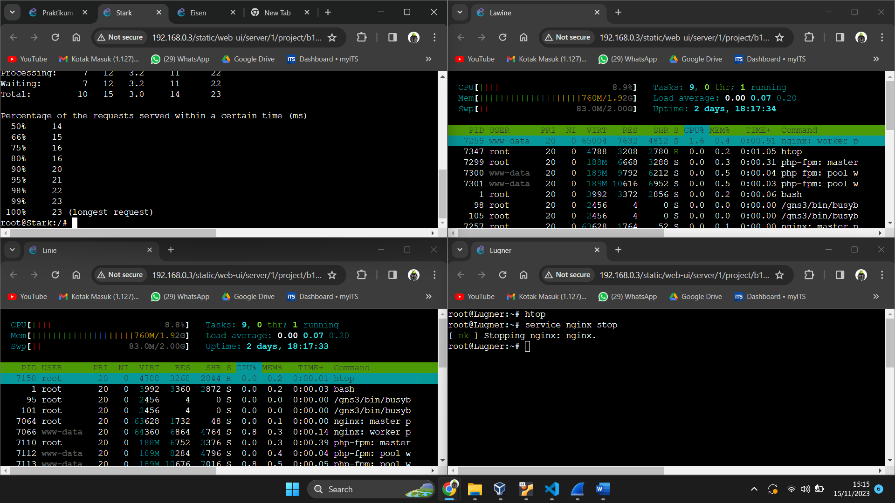


## 1 Worker
stop nginx di linie

Hasil Testing:
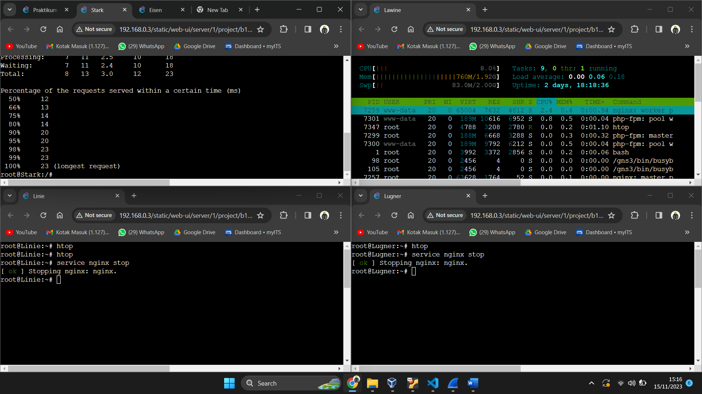


# Soal 10
Selanjutnya coba tambahkan konfigurasi autentikasi di LB dengan dengan kombinasi username: “netics” dan password: “ajkyyy”, dengan yyy merupakan kode kelompok. Terakhir simpan file “htpasswd” nya di /etc/nginx/rahasisakita/ 

## Pengerjaan
buat submit configAuth.sh untuk mengkonfigurasi autentikasi.

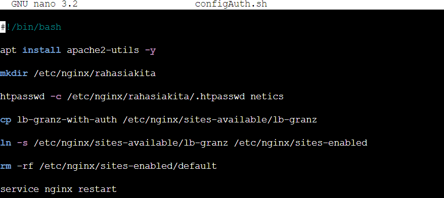

install package apache2-utils, buat direktori rahasiakita di /etc/nginx/. jalankan command htpasswd -c /etc/nginx/rahasiakita/.htpasswd netics untuk men-setting user netics dan password ajkd26. copy lb-granz-with-auth yang berisikan konfigurasi lb ke /etc/nginx/sites-available/lb-granz

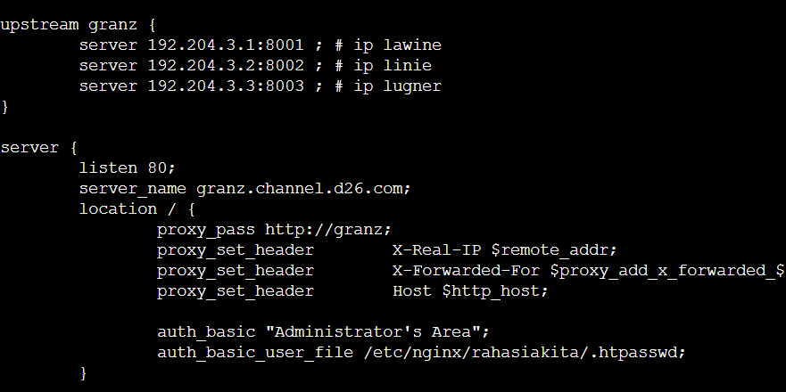
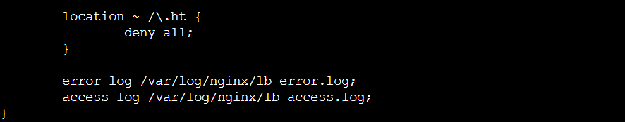

tambahkan auth_basic dan auth_basic_user_file. kemudian buat symbolic link antara /etc/nginx/sites-available/granz dengan /etc/nginx/sites-enabled. kemudian remove default pada /etc/nginx/sites-enabled. kemudian restart nginx.

jalankan dan masukkan ajkd26 sebagai password.

## Testing
```bash
lynx granz.channel.d26.com
```

Hasil:

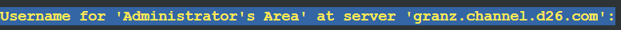
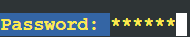

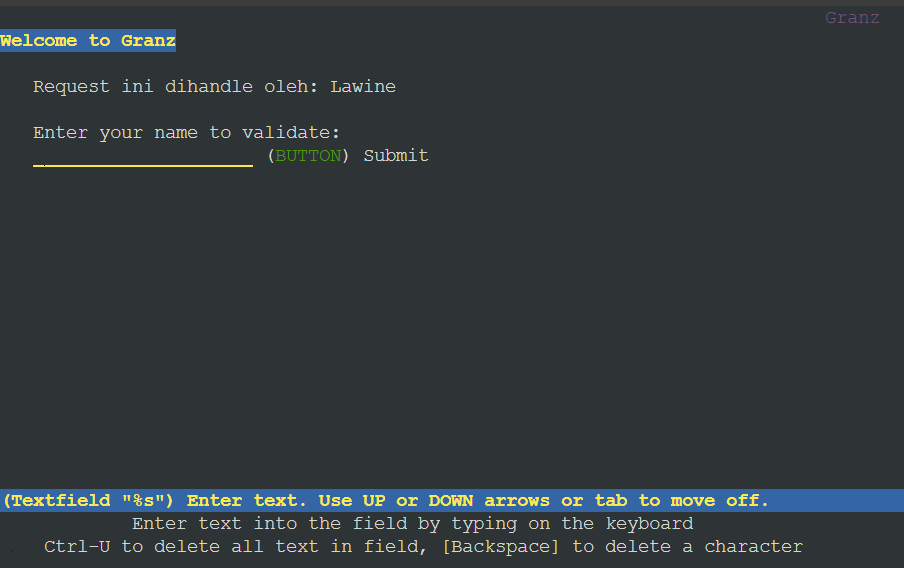

# Soal 11
Lalu buat untuk setiap request yang mengandung /its akan di proxy passing menuju halaman https://www.its.ac.id. (11) hint: (proxy_pass)

## Pengerjaan
tambahkan konfigurasi proxy_pass di lb-granz

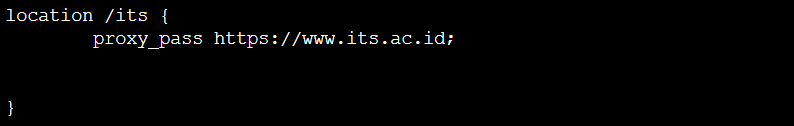

## Testing
jalankan:
```bash
lynx granz.channel.d26.com/its
```

hasil:

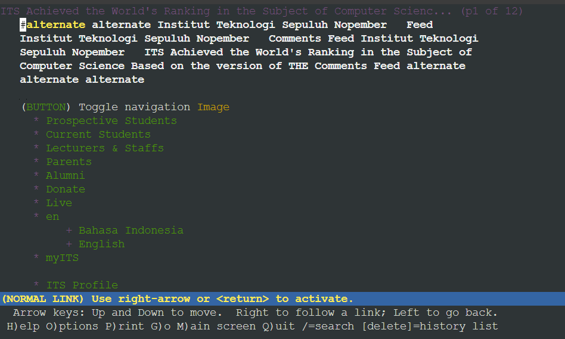

# Soal 12
Selanjutnya LB ini hanya boleh diakses oleh client dengan IP [Prefix IP].3.69, [Prefix IP].3.70, [Prefix IP].4.167, dan [Prefix IP].4.168. (12) hint: (fixed in dulu clinetnya)

## Pengerjaan
tambahkan konfigurasi di lb-granz

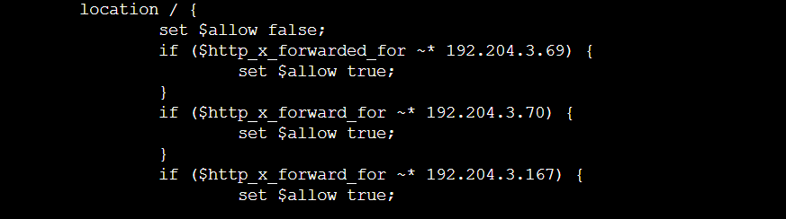


## Testing
jalankan:
```bash
lynx granz.channel.d26.com
```

di ip:

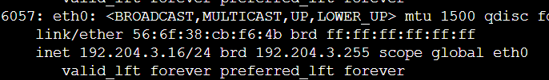

Hasil:

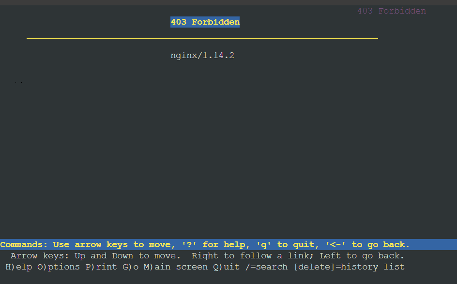

dapat dilihat akan me-return webServer sekarang coba di ip:

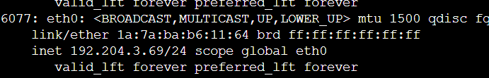

hasil:

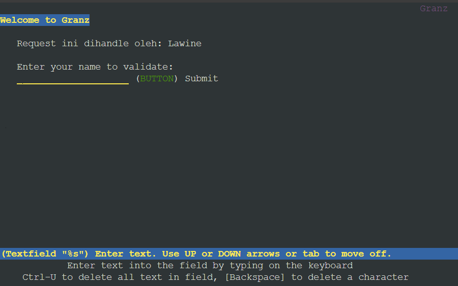

dapat dilihat ip 192.204.3.69 dapat mengakses web

# Soal 13
Semua data yang diperlukan, diatur pada Denken dan harus dapat diakses oleh Frieren, Flamme, dan Fern

## config DB Server
pertama buat script configDB.sh 

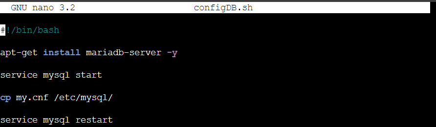

install package mariadb-server lalu start mysql. copy my.cnf ke /etc/mysql/

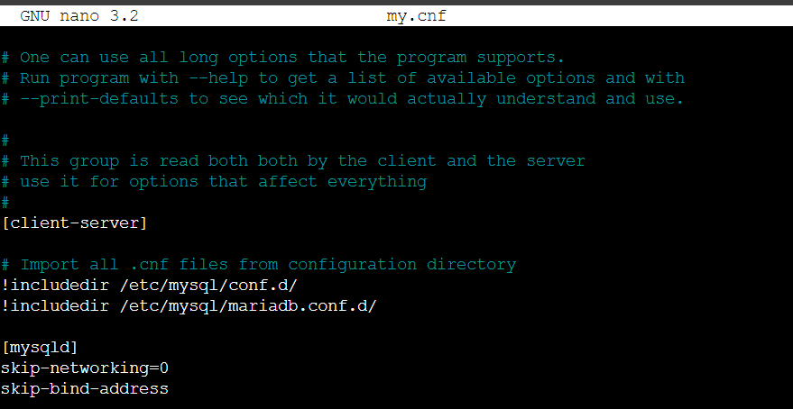

kemudian restart server.

masuk ke mysql console dan masukkan command:
```sql
CREATE USER 'kelompokd26'@'%' IDENTIFIED BY 'passwordd26';
CREATE USER 'kelompokd26'@'localhost' IDENTIFIED BY 'passwordd26';
CREATE DATABASE dbkelompokd26;
GRANT ALL PRIVILEGES ON *.* TO 'kelompokd26'@'%';
GRANT ALL PRIVILEGES ON *.* TO 'kelompokd26'@'localhost';
FLUSH PRIVILEGES;
```

untuk membuat user. dan cek databases

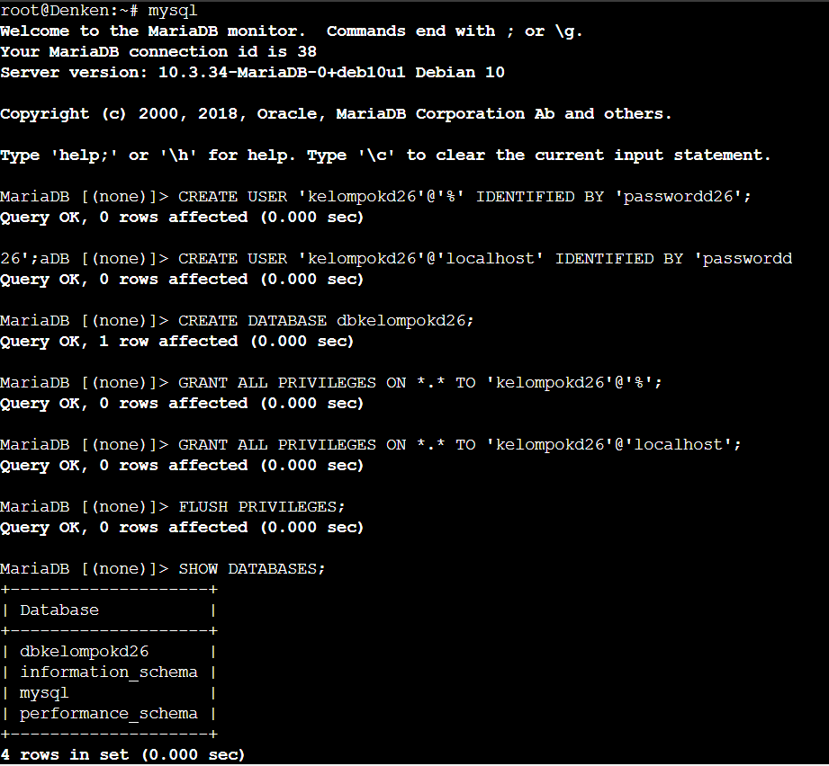

## Config DB Client
buat script configDBClient.sh pada tiap worker laravel

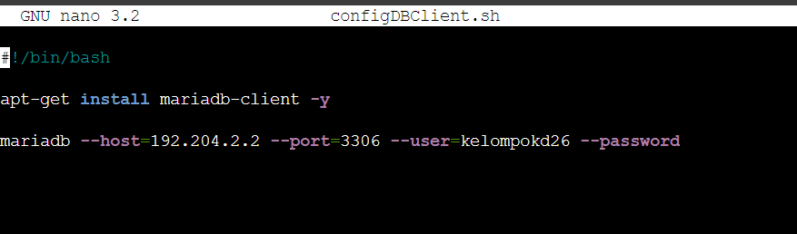

install package mariadb-client dan jalankan command untuk akses ke mariadb server. masukkan password: passwordd26

## Testing
Frieren:

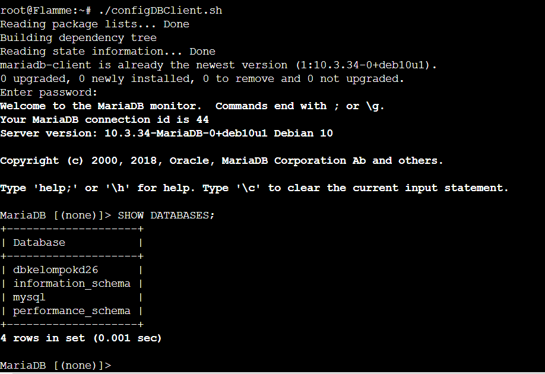

Flamme:

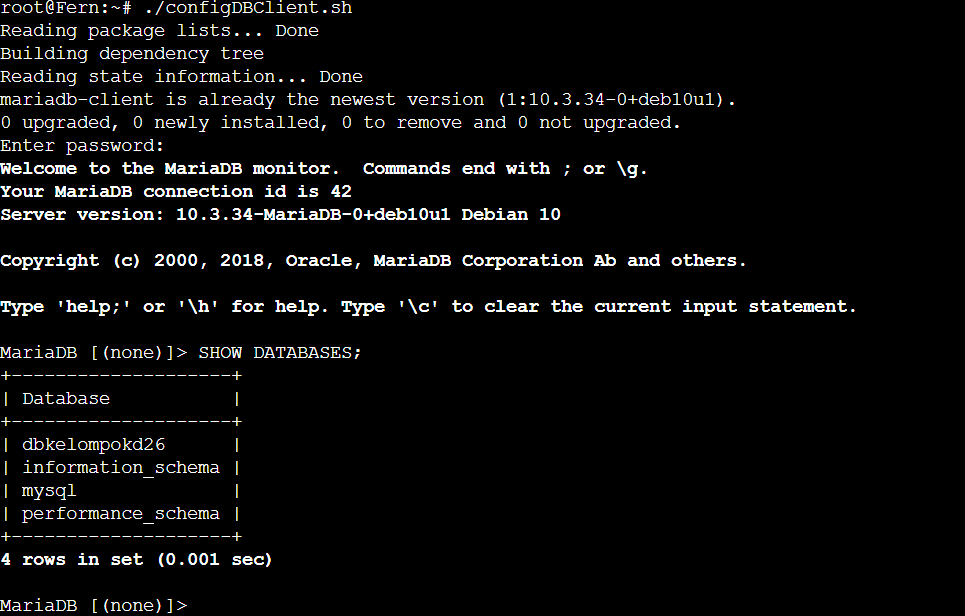

Fern:

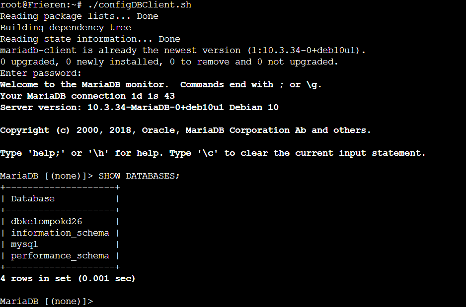

# Soal 14
# Soal 15
# Soal 16
# Soal 17
# Soal 18
# Soal 19
# Soal 20
